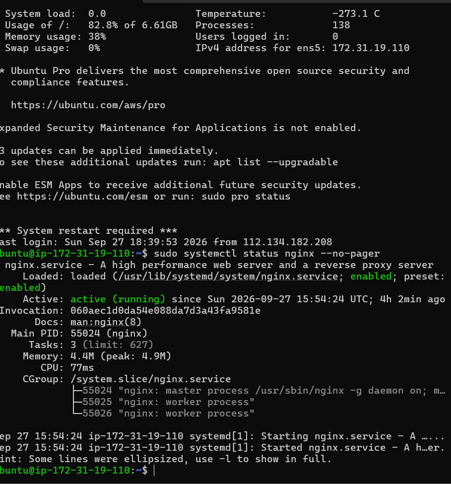
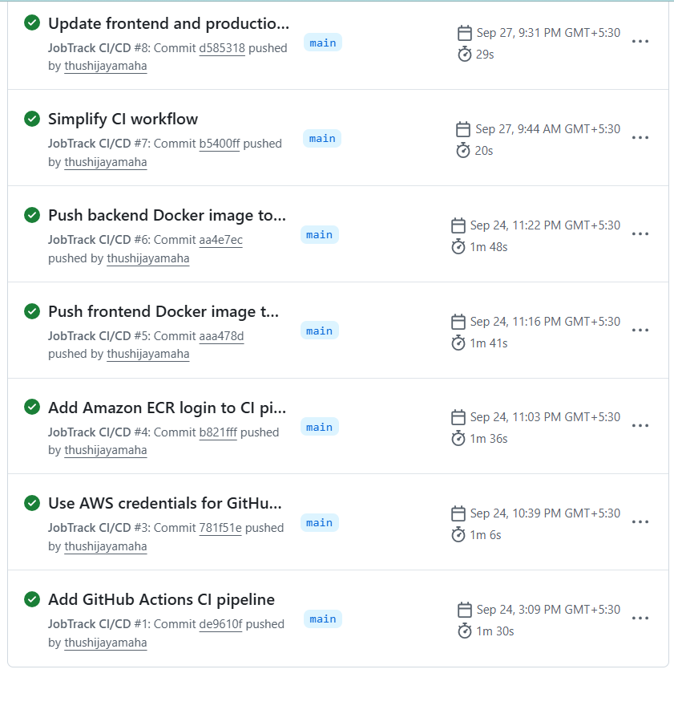
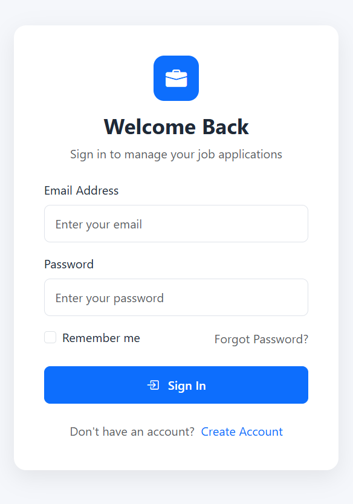
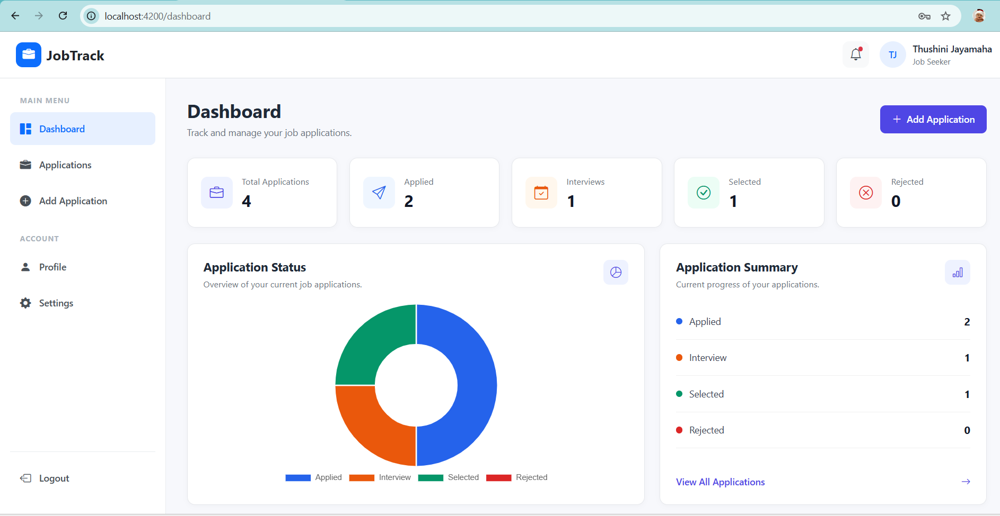

# 💼 JobTrack – Job Application Tracking System

JobTrack is a full-stack web application designed to help users organize, manage, and track their job applications in one place.

The system provides job application management, dashboard analytics, application status tracking, profile and settings management, resume handling, and export functionality through a responsive user interface.

---

## ✨ Key Features

- 🔐 User Registration & Authentication
- 📊 Dashboard with Application Statistics
- 📝 Add, View, Edit & Delete Job Applications
- 🔍 Search, Filter & Sort Applications
- 📌 Application Status Tracking
- 📜 Application Status History
- 👤 User Profile Management
- ⚙️ User Settings
- 📄 Resume Upload & Download
- 📤 CSV Export
- 📱 Responsive User Interface
- 🛡️ Protected Routes & API Authentication

---

## 🛠️ Tech Stack

### Frontend

- Angular 21
- TypeScript
- Bootstrap
- Bootstrap Icons
- Chart.js
- Angular Reactive Forms
- Angular HttpClient

### Backend

- Laravel 12
- PHP
- REST API
- Token-Based Authentication

### Database

- MySQL
- Amazon RDS for MySQL

### Cloud & DevOps

- AWS EC2
- Amazon RDS
- AWS IAM
- AWS Systems Manager (SSM)
- EC2 Security Groups
- Nginx
- PHP-FPM
- GitHub Actions
- Git & GitHub

---

## 🏗️ System Architecture

```text
              User / Browser
                    |
                    v
             +-------------+
             |    Nginx    |
             |   AWS EC2   |
             +------+------+
                    |
          +---------+---------+
          |                   |
          v                   v
  Angular Frontend      Laravel REST API
                              |
                              v
                       +-------------+
                       | Amazon RDS  |
                       |    MySQL    |
                       +-------------+
```

The Angular frontend and Laravel REST API are hosted on an AWS EC2 instance. Nginx serves the frontend and routes API requests to Laravel, while application data is stored in Amazon RDS for MySQL.

---

## ☁️ AWS Deployment

JobTrack is deployed using AWS cloud infrastructure.

### Deployment Setup

- **AWS EC2** hosts the Angular frontend and Laravel backend.
- **Nginx** serves the Angular application and routes API requests.
- **PHP-FPM** processes Laravel PHP requests.
- **Amazon RDS MySQL** provides the production database.
- **EC2 Security Groups** control network access.
- **AWS IAM** is used for AWS access management.
- **AWS Systems Manager (SSM)** is configured for secure EC2 instance management.

### EC2 & Nginx

The production server runs on an Ubuntu EC2 instance with Nginx and PHP-FPM.



---

## 🔄 Continuous Integration

JobTrack uses **GitHub Actions** for Continuous Integration.

When changes are pushed to the repository, the CI workflow validates the frontend and backend by performing tasks such as:

- Installing frontend dependencies
- Building the Angular application
- Installing Laravel Composer dependencies
- Preparing the Laravel test environment
- Running Laravel automated tests

This helps verify that frontend and backend changes build and test successfully.

> Automatic EC2 deployment is planned as a future CI/CD improvement.

### GitHub Actions CI



---

## 📸 Application Screenshots

### Login Page



### Dashboard



---

## 📁 Project Structure

```text
JobTrack/
│
├── frontend/                 # Angular frontend application
│
├── backend/                  # Laravel REST API
│
├── .github/
│   └── workflows/
│       └── ci.yml            # GitHub Actions workflow
│
├── docs/
│   └── screenshots/
│       ├── login.png
│       ├── dashboard.png
│       ├── github-actions-ci.png
│       └── ec2-nginx-terminal.png
│
└── README.md
```

---

## 🚀 Run Locally

### Prerequisites

Make sure the following are installed:

- Node.js
- npm
- PHP 8.2 or later
- Composer
- MySQL
- Git

### 1. Clone the Repository

```bash
git clone https://github.com/thushijayamaha/JobTrack.git
cd JobTrack
```

### 2. Backend Setup

Navigate to the backend directory:

```bash
cd backend
```

Install PHP dependencies:

```bash
composer install
```

Create the environment file:

```bash
cp .env.example .env
```

Generate the Laravel application key:

```bash
php artisan key:generate
```

Configure your MySQL database credentials in the `.env` file.

Run the database migrations:

```bash
php artisan migrate
```

Start the Laravel development server:

```bash
php artisan serve
```

The Laravel API runs by default at:

```text
http://127.0.0.1:8000
```

### 3. Frontend Setup

Open another terminal and navigate to the frontend directory:

```bash
cd frontend
```

Install dependencies:

```bash
npm install
```

Start the Angular development server:

```bash
npm start
```

The Angular application runs by default at:

```text
http://localhost:4200
```

---

## 🧪 Build & Testing

### Frontend Build

```bash
cd frontend
npm run build
```

### Backend Tests

```bash
cd backend
php artisan test
```

---

## 🔒 Security

Sensitive configuration such as database credentials, application keys, AWS credentials, and private keys are not stored in the repository.

Environment-specific configuration is managed using environment variables and AWS security services.

Network access between the EC2 application server and Amazon RDS database is controlled using AWS Security Groups.

---

## 🎯 Project Purpose

JobTrack was developed as a full-stack portfolio project to gain practical experience in:

- Modern frontend development with Angular
- REST API development with Laravel
- MySQL database management
- Full-stack application architecture
- AWS cloud deployment
- Linux server administration
- Nginx and PHP-FPM configuration
- GitHub Actions CI
- Cloud security and access management

---

## 👩‍💻 Author

**Thushini Jayamaha**

BSc Information Technology Undergraduate

GitHub: `thushijayamaha`

---

## 📌 Project Status

🟢 **Active / Deployed**

Core application development, AWS deployment, and Continuous Integration are completed.

Future improvements may include enhanced application features, HTTPS/domain configuration, and fully automated Continuous Deployment (CD).